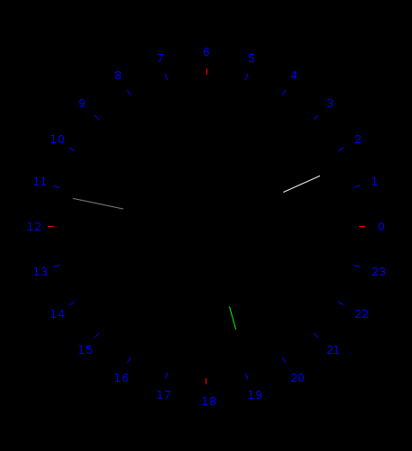

.. Copyright © 2014, 2016-2017 Martin Ueding <dev@martin-ueding.de>

##########
math-clock
##########

A clock with 24 hours, counter clockwise moving hands that start at the angle
0° in the mathematical sense:

The colors are a little weird, though. I think I wrote this around 2011.

Download
========

This is the compiled program `<mathclock.jar>`_
